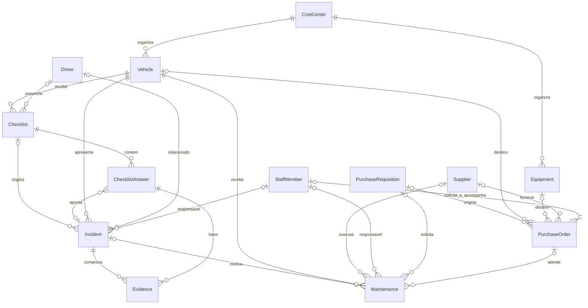

# Modelo de dados — Central de Controle de Frota

Evolução da base existente em PostgreSQL/Prisma. Os identificadores internos permanecem em inglês para compatibilidade com as consultas e telas implementadas. Nenhuma tabela anterior foi recriada.

## Dicionário dos campos solicitados

### Veículos — `Vehicle`

| Campo de negócio | Campo Prisma | Regra |
| --- | --- | --- |
| ID | `id` | Identificador existente preservado |
| Placa | `plate` | Única |
| Prefixo | `code` | Único; mantém o nome já utilizado na aplicação |
| Tipo | `category` | Classificação livre existente, como Caminhão/Utilitário/Leve |
| Marca / modelo / ano | `brand`, `model`, `year` | Marca desconhecida permanece nula; modelos antigos não foram reescritos |
| Centro de custo | `costCenterId` → `CostCenter` | Independente de `unit`, que continua sendo a unidade operacional |
| Quilometragem atual | `mileage` | Inteiro não negativo |
| Status | `status` | `VehicleStatus` |
| Disponibilidade | `availability` | `AVAILABLE` / `UNAVAILABLE`; disponível exige ativo e status operacional |
| Última preventiva | `lastPreventiveAt` | Opcional |
| Próxima preventiva KM / data | `nextPreventiveMileage`, `nextPreventiveAt` | O primeiro limite alcançado exige avaliação; valores opcionais |
| Observações / ativo | `notes`, `active` | Texto e indicador lógico |

`qrToken`, `unit` e os relacionamentos anteriores foram preservados. O token de checklist não foi rotacionado pela migração. As datas de preventiva são resumos operacionais persistidos: os futuros fluxos de conclusão/reprogramação deverão atualizá-los na mesma transação de manutenção/preventiva. A migração preencheu os resumos apenas quando havia registros de origem.

### Motoristas — `Driver`

| Campo de negócio | Campo Prisma |
| --- | --- |
| ID / nome / matrícula | `id`, `name`, `employeeId` (única) |
| Telefone | `phone` (opcional) |
| CNH / validade | `license` (única), `expiresAt` |
| Status / ativo | `status` (`ACTIVE`, `ON_LEAVE`, `SUSPENDED`, `INACTIVE`), `active` |

`category` preserva a categoria da CNH. O status administrativo é distinto do vencimento da CNH, calculado pela data. Não é criada identidade de motorista com base apenas em nome semelhante.

### Checklists — `Checklist`

| Campo de negócio | Campo Prisma |
| --- | --- |
| ID / veículo / motorista | `id`, `vehicleId`, `driverId` |
| Tipo | `type`: `PRE_TRIP`, `POST_TRIP`, `PERIODIC`, `EXTRAORDINARY`, `UNSPECIFIED` |
| Data/hora / quilometragem | `submittedAt`, `mileage` |
| Localização | `latitude`, `longitude`, `locationAccuracy` (metros), `locationLabel` |
| Percentual de conformidade | `conformityPercentage`: `Decimal(5,2)` entre 0 e 100 ou nulo |
| Possui problema | `hasProblem` |
| Status | `status`: `DRAFT`, `SUBMITTED`, `REVIEWED`, `CANCELED` |
| Observações | `notes` |

O nome declarado permanece em `driverName`, inclusive quando não existe cadastro vinculado. `driverId` é opcional para preservar o fluxo simples e os registros históricos. Informar um ID no envio vincula um cadastro ativo, mas não autentica a identidade do condutor. `submissionKey` continua única e garante idempotência.

`result` é separado do status de revisão: `OK`, `ISSUE` ou `NOT_EVALUATED`. A conformidade é `100 × respostas OK / respostas aplicáveis`, arredondada para duas casas; `NOT_APPLICABLE` não entra no denominador. Sem respostas aplicáveis, o percentual é nulo, nunca 100% presumido. A API calcula esses campos no servidor.

As coordenadas devem ser informadas em par, latitude entre −90 e 90, longitude entre −180 e 180 e precisão não negativa. A localização é opcional; o formulário não passou a coletar GPS automaticamente.

### Itens do checklist — `ChecklistAnswer`

| Campo de negócio | Campo Prisma |
| --- | --- |
| ID / checklist | `id`, `checklistId` |
| Categoria / item | `category` (`InspectionCategory`), `item` |
| Resposta | `answer`: `OK`, `ISSUE`, `NOT_APPLICABLE` |
| Criticidade | `priority` (`Priority`) |
| Observação | `notes` |
| Foto(s) | `photos` → `Evidence[]` |
| Gera ocorrência | `generatesIncident` |
| Ocorrência gerada | `incidentId` → `Incident` |

O par checklist/item é único. `generatesIncident` indica a necessidade de ocorrência; `incidentId` indica o vínculo efetivamente registrado. Essa distinção preserva itens históricos com ressalva, mas sem vínculo comprovável. A criticidade é copiada da definição do item para manter o contexto da inspeção.

### Ocorrências — `Incident`

| Campo de negócio | Campo Prisma |
| --- | --- |
| ID / número | `id`, `number` (sequência única do PostgreSQL) |
| Origem | `origin`: `MANUAL`, `CHECKLIST`, `MAINTENANCE`, `UNSPECIFIED` |
| Veículo / motorista / checklist | `vehicleId`, `driverId`, `checklistId` |
| Categoria | `category` (`InspectionCategory`) |
| Problema / descrição | `title`, `description` |
| Criticidade / status | `priority`, `status` |
| Abertura / prazo | `openedAt`, `dueAt` |
| Responsável | `responsibleId` → `StaffMember` |
| Veículo bloqueado | `vehicleBlocked` |
| Solução: data / texto | `resolvedAt`, `solution` |
| Evidências | `evidence` → `Evidence[]` |

As telas formatam o número como `OC-000001`. A sequência é segura para concorrência e pode ter lacunas após rollback; não representa quantidade de ocorrências. Vários itens problemáticos podem apontar para a mesma ocorrência. Problema em freios continua criando ocorrência crítica e torna o veículo parado/indisponível. `vehicleBlocked` registra a indicação de bloqueio daquela ocorrência, e `Vehicle.availability` representa a condição operacional atual.

Registros antigos não são vinculados por aproximação de placa ou data. A migração só recupera o vínculo quando existe um protocolo exato na descrição e o veículo coincide; o restante conserva origem não informada.

### Manutenções — `Maintenance`

| Campo de negócio | Campo Prisma |
| --- | --- |
| ID / veículo | `id`, `vehicleId` |
| Tipo / categoria / descrição | `type`, `category`, `description` |
| OS | `serviceOrder` (única quando preenchida) |
| SC | `requisitionId` → `PurchaseRequisition.number` |
| Pedido | `purchaseOrderId` → `PurchaseOrder.number` |
| Fornecedor | `supplierId` |
| Orçamento / valor aprovado | `budget`, `approvedAmount`: `Decimal(12,2)` |
| Status | `status` (`WorkStatus`) |
| Entrada / previsão / conclusão | `enteredAt`, `expectedAt`, `completedAt` |
| Quilometragem / responsável | `mileage`, `responsibleId` |

`title`, `scheduledAt` e `cost` permanecem compatíveis com a interface existente. `cost` mantém seu histórico; os novos campos distinguem orçamento e aprovação sem presumir que todo custo antigo foi aprovado. `incidentId` permite rastrear qual ocorrência motivou o serviço. Tipo/categoria de manutenção permanecem textos extensíveis para preservar a classificação existente. Valores financeiros e quilometragem não aceitam negativos; conclusão/previsão não podem anteceder uma entrada conhecida.

### Pedidos de compras — `PurchaseOrder`

| Campo de negócio | Campo Prisma |
| --- | --- |
| ID / SC / pedido | `id`, `requisitionId`, `number` (único) |
| Descrição | `description` |
| Veículo/equipamento | `vehicleId` ou `equipmentId` |
| Fornecedor / valor | `supplierId`, `amount`: `Decimal(12,2)` |
| Solicitante / responsável | `requesterId`, `responsibleId` → `StaffMember` |
| Data / status / observação | `requestedAt`, `status`, `notes` |

Um pedido não pode apontar simultaneamente para veículo e equipamento. Ambos podem ficar nulos para materiais de uso geral. Uma SC pode originar vários pedidos e ser compartilhada com manutenções. O vínculo com a SC e o vínculo com o pedido são separados para permitir solicitação anterior à emissão do pedido.

### Fornecedores — `Supplier`

| Campo de negócio | Campo Prisma |
| --- | --- |
| ID / razão social | `id`, `name` |
| Nome fantasia | `tradeName` |
| CNPJ | `taxId` (único) |
| Contato / telefone / email | `contactName`, `phone`, `email` |
| Especialidade | `specialty` |
| Status | `status`: `ACTIVE`, `SUSPENDED`, `INACTIVE` |

`active` foi preservado por compatibilidade. CNPJs, CNHs, telefones e matrículas são texto para preservar zeros e identificação legada. Os seeds usam identificadores explicitamente fictícios; não representam documentos válidos de pessoas ou empresas. Validação/normalização de documentos deverá acompanhar os futuros formulários de cadastro.

## Tabelas auxiliares e regras compartilhadas

- `CostCenter`: código único, nome, ativo; relaciona veículos e equipamentos.
- `StaffMember`: matrícula única, nome, email opcional, ativo; responsáveis e solicitantes operacionais. Não substitui usuários/senhas/perfis de autenticação.
- `Equipment`: código único, nome, ativo e centro de custo, utilizado em compras.
- `PurchaseRequisition`: número único da SC, descrição e solicitante.
- `Evidence`: metadados de arquivo (`fileName`, `storageKey`, `mimeType`, `sizeBytes`, `description`) pertencentes a exatamente uma ocorrência ou um item. Permite várias fotos/evidências sem listas de URLs concatenadas. Não implementa upload nem integração com armazenamento.
- `Priority`: `LOW`, `MEDIUM`, `HIGH`, `CRITICAL`.
- `WorkStatus`: `OPEN`, `IN_PROGRESS`, `COMPLETED`, `CANCELED`, preservado nos fluxos existentes.
- `InspectionCategory`: `TIRES`, `LIGHTING`, `BRAKES`, `FLUIDS`, `SAFETY`, `BODY`, `OTHER`.

As sete entidades principais, itens, anexos e tabelas auxiliares têm `createdAt` e `updatedAt`. A atualização automática de `updatedAt` é feita pelo Prisma; scripts SQL externos devem atualizá-lo explicitamente. Valores anteriores de timestamps não foram modificados pela migração. Para tabelas sem data histórica de criação, a nova data registra a migração, não uma data de negócio inventada.

Há índices para filtros operacionais e chaves estrangeiras. Novos vínculos de histórico usam `RESTRICT` quando a exclusão perderia rastreabilidade. As políticas anteriores foram preservadas; por exemplo, excluir um motorista pode remover o vínculo, mantendo o nome registrado no checklist. A exclusão física não é a rotina de desativação: utilizar `active`/status.

## Migração e seeds

`202609280002_data_model` é transacional. Não contém exclusão de tabelas/colunas nem reset. A conversão de respostas/resultados para enums utiliza `ALTER COLUMN … USING`, conservando os valores; valores legados desconhecidos interrompem a transação em vez de serem descartados. As regras `CHECK` adicionais vivem na migração SQL e precisam ser preservadas em futuras evoluções.

Os dados anteriores foram comparados campo a campo com `.local-backups/before-data-model-v2.json`, arquivo local ignorado pelo Git. Campos novos sem fonte confiável permanecem opcionais. Não foram presumidos centro de custo, telefone, responsável, aprovação ou vínculos históricos.

`prisma/seed.ts` continua idempotente. `prisma/seed-data-model.ts` acrescenta um conjunto isolado `DEMO-*`, demonstrando toda a cadeia de relacionamentos. Atualizações vazias preservam edições posteriores. As evidências desse exemplo são explicitamente metadados fictícios, sem arquivo físico.

Comandos: `pnpm db:generate`, `pnpm db:migrate`, `pnpm db:seed`. Não utilizar `migrate reset` nem `db push --accept-data-loss` para esta evolução.

Validações adicionais: `node scripts/verify-data-model.mjs` (integridade, seed e rollback), `node scripts/data-snapshot.mjs verify` (preservação dos dados originais) e `node scripts/verify.mjs` (aplicação e API).
